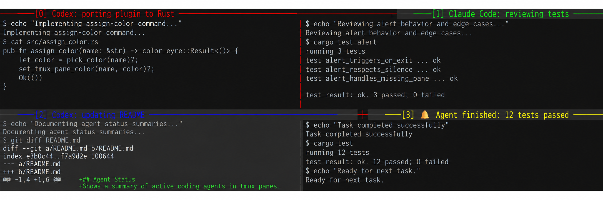

# tmux-pane-beacon

## 概要

tmux の各ペインに固有色を割り当て、上側の枠線にペイン番号とタイトルを表示する TPM プラグインです。Codex や Claude Code などのエージェントは、現在の作業要約と状態をペインへ送れます。バックグラウンドのペインへアラートを設定し、そのペインを選択したときに自動解除することもできます。主要処理は Rust 製です。



ペイン 0〜2 はタイトルを表示し、ペイン 3 にはアラートが立っているため `🔔 deploy finished` を表示しています。アラートはそのペインを選択するまで残ります。

English version: [README.md](README.md)

## 要件

- tmux 3.0 以降 (ペイン単位オプション `set-option -p` と hook の配列指定を使うため)
- Rust 1.85 以降
- bash (TPM の入口のみ)

動作確認は tmux 3.7b (macOS) と tmux 3.2a (Ubuntu on WSL) で行っています。

## 導入

TPM の設定に次の行を追加し、`prefix + I` でプラグインを読み込みます。

```tmux
set -g @plugin 'ryuchan00/tmux-pane-beacon'
```

TPM はソースを取得します。初回にネイティブバイナリをビルドし、tmux を再読込してください。

```bash
cd ~/.tmux/plugins/tmux-pane-beacon
make build
tmux source-file ~/.tmux.conf
```

CI では Intel/Arm の Linux と macOS 向けバイナリをビルドします。

ローカル開発では、このディレクトリを TPM のプラグインディレクトリへ symlink します。TPM は既存のディレクトリを導入済みとして扱うので、上の `@plugin` 行はそのままで動きます。

```bash
ln -s /path/to/tmux-pane-beacon ~/.tmux/plugins/tmux-pane-beacon
```

設定を変更した場合は tmux の設定ファイルを再読込してください。

## オプション

| オプション | 既定値 | 説明 |
|---|---|---|
| `@pane_beacon_palette` | `196 46 21 226 201 51 208 118 27 199 214 82 39 220 165 50 202 154 33 129 190 48 57 93 197 45 213 159 87 228` | 循環して割り当てる 256 色番号 |
| `@pane_beacon_title_fallback` | `#{pane_current_command}` | タイトルがホスト名のままの場合に表示する format |
| `@pane_beacon_title_max` | `60` | タイトルの最大表示幅 |
| `@pane_beacon_alert_icon` | `🔔` | アラートの先頭に表示する記号 |

設定例です。

```tmux
set -g @pane_beacon_palette '10 20 30'
set -g @pane_beacon_title_max '40'
set -g @pane_beacon_alert_icon '!'
```

## アラート

公開コマンドの形式は次のとおりです。

```text
scripts/alert.sh <pane_id> <message> [window-status-style]
```

第 3 引数を省略した場合は `fg=yellow,bold` を使います。対象が接続中セッションのアクティブなウィンドウにあるアクティブペインなら、表示済みと判断して何も設定しません。

外部ツールから現在のペインへ完了通知を出す例です。

```bash
~/.tmux/plugins/tmux-pane-beacon/scripts/alert.sh "$TMUX_PANE" "処理が完了しました"
```

独自のウィンドウ表示色も指定できます。

```bash
~/.tmux/plugins/tmux-pane-beacon/scripts/alert.sh "$TMUX_PANE" "入力を待っています" "fg=magenta,bold"
```

アラートは対象ペインを選択すると解除されます。

## コーディングエージェント

エージェントや hook から、短い作業要約と状態をペインへ送れます。

```bash
~/.tmux/plugins/tmux-pane-beacon/target/release/pane-beacon update "$TMUX_PANE" \
  --agent codex --status working --summary "Rust への移植を実装中"
```

状態は `working`、`waiting`、`completed`、`error` を指定できます。`waiting`、`completed`、`error` は、対象ペインが表示されていない場合にアラートも設定します。

## 注意

`pane-active-border-style` は、選択中のペイン固有色を即時反映するためウィンドウ単位で上書きされます。そのため、このオプションに対する利用者のグローバル設定はアクティブペインの枠には反映されません。

## テスト

Rust の単体テスト、隔離した tmux サーバーを使う振る舞いテスト、残ったシェルの静的検査を実行できます。bats-core と shellcheck が必要です。

```bash
make test
make lint
```

## ライセンス

MIT ライセンスです。[LICENSE](LICENSE) を参照してください。
